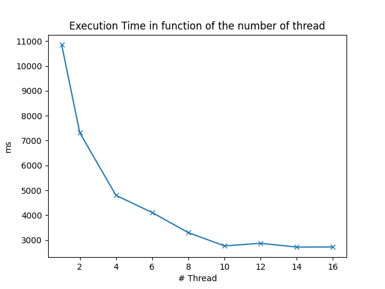
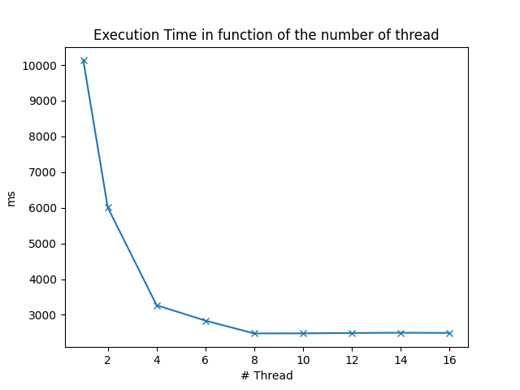
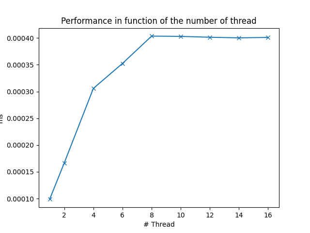
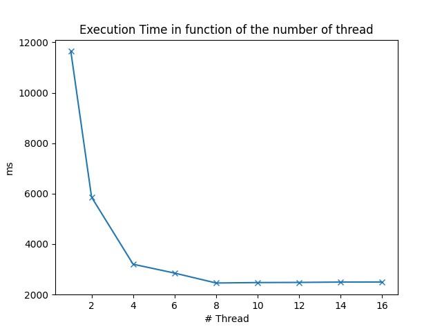

# Prob1 report

**Antoine DESRUET 50221600**

## Environment

| Os               | Pop!_OS 22.04 LTS x86         |
|------------------|-------------------------------|
| CPU              | Intel i7-8665U (8) @ 1.900GHz |
| Memory           | 16Gb                          |
| GCC version      | 14.0.0                        |
| GNU Make version | 4.3                           | 

## Build

In the prob1 folder:

### GNU Make

```shell
make
```

### CLI

```shell
gcc -o a.out ./prob1.c ./prime_counter.c  -fopenmp
```

## Static

### Tables

|Number of thread|Execution time|Performance           |
|----------------|--------------|----------------------|
|1               |10856         |9.211495946941784e-05 |
|2               |7315          |0.0001367053998632946 |
|4               |4796          |0.0002085070892410342 |
|6               |4105          |0.000243605359317905  |
|8               |3294          |0.00030358227079538557|
|10              |2761          |0.0003621876131836291 |
|12              |2865          |0.00034904013961605586|
|14              |2712          |0.0003687315634218289 |
|16              |2716          |0.0003681885125184094 |

### Graphs




## Static with 10 chunks

### Tables

|Number of thread|Execution time|Performance           |
|----------------|--------------|----------------------|
|1               |10447         |9.572125969177755e-05 |
|2               |6123          |0.00016331863465621427|
|4               |3199          |0.00031259768677711783|
|6               |3494          |0.00028620492272467084|
|8               |2502          |0.0003996802557953637 |
|10              |2574          |0.0003885003885003885 |
|12              |2682          |0.0003728560775540641 |
|14              |2554          |0.00039154267815191856|
|16              |2487          |0.0004020908725371934 |


### Graphs


## Dynamic

### Tables

|Number of thread|Execution time|Performance           |
|----------------|--------------|----------------------|
|1               |10128         |9.873617693522907e-05 |
|2               |6008          |0.00016644474034620507|
|4               |3270          |0.0003058103975535168 |
|6               |2837          |0.00035248501938667606|
|8               |2478          |0.0004035512510088781 |
|10              |2481          |0.00040306328093510683|
|12              |2491          |0.0004014452027298274 |
|14              |2498          |0.00040032025620496394|
|16              |2493          |0.00040112314480545525|

### Graphs






## Dynamic with 10 chunks

### Tables

|Number of thread|Execution time|Performance           |
|----------------|--------------|----------------------|
|1               |11645         |8.587376556462001e-05 |
|2               |5859          |0.00017067759003242875|
|4               |3200          |0.0003125             |
|6               |2848          |0.00035112359550561797|
|8               |2455          |0.0004073319755600815 |
|10              |2473          |0.0004043671653861706 |
|12              |2479          |0.0004033884630899556 |
|14              |2492          |0.0004012841091492777 |
|16              |2495          |0.0004008016032064128 |

### Graphs




