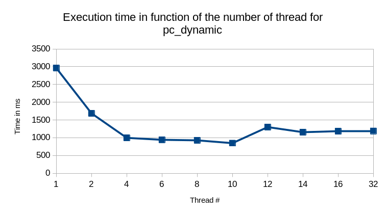

# Problem1 repport

## Environnement

| Os     | Pop!_OS 22.04 LTS x86         |
|--------|-------------------------------|
| CPU    | Intel i7-8665U (8) @ 1.900GHz |
| Memory | 16Gb                          |
|Java version | openjdk 17.0.6 2023-01-17|

## Build

In the `problem1` directory

```sh
javac pc_static_bloc.java
javac pc_static_cyclic.java
javac pc_dynamic.java
```

## How to use

### pc_static_block

To use with the default values
> NUM_END = 200000
> NUM_THREAD = 10

```sh
java pc_static_block
```

To use with custom arguments

```sh
java pc_static_block < NUM_THREAD > < NUM_END>
```

### pc_static_cyclic

To use with the default values
> NUM_END = 200000
> NUM_THREAD = 10
> TASK_SIZE = 10

```sh
java pc_static_cyclic
```

To use with custom arguments

```sh
java pc_static_cyclic < NUM_THREAD > < NUM_END > < TASK_SIZE >
```

### pc_dynamic

To use with the default values
> NUM_END = 200000
> NUM_THREAD = 10
> TASK_SIZE = 10

```sh
java pc_dynamic
```

To use with custom arguments

```sh
java pc_dynamic < NUM_THREAD > < NUM_END > < TASK_SIZE >
```

## Results

Thoses result were obtained with `NUM_END` = 200000.

### Raw

| Number of threads | time in ms (static block) | time in ms (static cyclic) | time in ms (dynamic) |
|-------------------|---------------------------|----------------------------|----------------------|
| 1                 | 29.000                    | 28.000                     | 2963.000             |
| 2                 | 29.000                    | 27.000                     | 1685.000             |
| 4                 | 30.000                    | 28.000                     | 996.000              |
| 6                 | 30.000                    | 28.000                     | 941.000              |
| 8                 | 28.000                    | 28.000                     | 926.000              |
| 10                | 29.000                    | 29.000                     | 847.000              |
| 12                | 37.000                    | 36.000                     | 1299.000             |
| 14                | 44.000                    | 42.000                     | 1155.000             |
| 16                | 44.000                    | 41.000                     | 1182.000             |
| 32                | 45.000                    | 43.000                     | 1189.000             |

### Graphs




## Interpretation

As we can see the static load balencing is more efficient for this type of calculus. This may be due to the use frenquency of `lock` in the dynamical approache.

Tasks are too shorts to make the dynamical load balencing efficient.

We can also see, for the static load balencing that after 10 threads, the execution time increase. So we can assume that for `200000` numbers, 10 threads are enougth.

## Source code

### pc_static_block.java

```java
class pcThreadStaticBlock extends Thread {
    int begin;
    int end;
    int result = 0;

    pcThreadStaticBlock(int b, int e) {
        begin = b;
        end = e;
    }

    public void run() {
        long startTime = System.currentTimeMillis();
        for (int i = begin; i < end; ++i) {
            result += isPrime(i);
        }
        long endTime = System.currentTimeMillis();
        long timeDiff = endTime - startTime;
        System.out.printf("Execution Time of thread %d : %d ms\n", Thread.currentThread().getId(), timeDiff);
    }

    private static int isPrime(int x) {
        if ((x <= 1) || (x & 1) == 0)
            return 0;
        for (int i = 3; i < x; i++) {
            if ((x % i == 0) && (i != x))
                return 0;
        }
        return 1;
    }
}

class pc_static_block {
    private static int NUM_END = 200000;
    private static int N_THREAD = 10;

    public static void main(String[] args) {
        int result = 0;
        N_THREAD = args.length >= 1 ? Integer.parseInt(args[0]) : N_THREAD;
        NUM_END = args.length >= 2 ? Integer.parseInt(args[1]) : NUM_END;
        pcThreadStaticBlock[] threads = new pcThreadStaticBlock[N_THREAD];
        int range = NUM_END / N_THREAD;
        long startTime = System.currentTimeMillis();
        for (int i = 0; i < threads.length; ++i) {
            threads[i] = new pcThreadStaticBlock(i * range, i * range + range);
            threads[i].start();
        }
        for (int i = 0; i < threads.length; ++i) {
            try {
                threads[i].join();
                result += threads[i].result;
            } catch (InterruptedException e) {
            }
        }
        long endTime = System.currentTimeMillis();
        long timeDiff = endTime - startTime;
        System.out.printf("Execution Time : %d ms\n", timeDiff);
        System.out.printf("1... %d prime# counter == %d\n", NUM_END - 1, result);
    }
}
```

### pc_static_cyclic.java

```java
class pcThreadStaticCyclic extends Thread {
    int begin;
    int end;
    int task_size;
    int n_thread;
    int result = 0;

    pcThreadStaticCyclic(int b, int e, int o, int n) {
        begin = b;
        end = e;
        task_size = o;
        n_thread = n;
    }

    public void run() {
        long startTime = System.currentTimeMillis();

        for (; begin < end; begin += task_size * n_thread) {
            for (int i = begin; i < begin + task_size; ++i) {
                result += isPrime(i);
            }
        }
        long endTime = System.currentTimeMillis();
        long timeDiff = endTime - startTime;
        System.out.printf("Execution Time of thread %d : %d ms\n", Thread.currentThread().getId(), timeDiff);
    }

    private static int isPrime(int x) {
        if ((x <= 1) || (x & 1) == 0)
            return 0;
        for (int i = 3; i < x; i++) {
            if ((x % i == 0) && (i != x))
                return 0;
        }
        return 1;
    }
}

class pc_static_cyclic {
    private static int NUM_END = 200000;
    private static int N_THREAD = 10;
    private static int TASK_SIZE = 10;

    public static void main(String[] args) {
        int result = 0;
        N_THREAD = args.length >= 1 ? Integer.parseInt(args[0]) : N_THREAD;
        NUM_END = args.length >= 2 ? Integer.parseInt(args[1]) : NUM_END;
        TASK_SIZE = args.length >= 3 ? Integer.parseInt(args[2]) : TASK_SIZE;

        pcThreadStaticCyclic[] threads = new pcThreadStaticCyclic[N_THREAD];
        long startTime = System.currentTimeMillis();
        for (int i = 0; i < threads.length; ++i) {
            threads[i] = new pcThreadStaticCyclic(i * TASK_SIZE, NUM_END, TASK_SIZE, N_THREAD);
            threads[i].start();
        }
        for (int i = 0; i < threads.length; ++i) {
            try {
                threads[i].join();
                result += threads[i].result;
            } catch (InterruptedException e) {
            }
        }
        long endTime = System.currentTimeMillis();
        long timeDiff = endTime - startTime;
        System.out.printf("Execution Time : %d ms\n", timeDiff);
        System.out.printf("1... %d prime# counter == %d\n", NUM_END - 1, result);
    }
}
```

### pc_dynamic.java

```java
import java.util.PriorityQueue;

class pcThreadDynamic extends Thread {
    int end;
    int task_size;
    int result = 0;
    PriorityQueue<Integer> numbersRef;

    pcThreadDynamic(PriorityQueue<Integer> nRef, int t_size, int e) {
        end = e;
        task_size = t_size;
        numbersRef = nRef;
    }

    public void run() {
        long startTime = System.currentTimeMillis();

        while (true) {
            int begin = getNextNumber(numbersRef);
            if (begin == -1) {
                break;
            }
            for (int i = begin; i < begin + task_size; ++i) {
                result += isPrime(i);
            }

        }
        long endTime = System.currentTimeMillis();
        long timeDiff = endTime - startTime;
        System.out.printf("Execution Time of thread %d : %d ms\n", Thread.currentThread().getId(), timeDiff);
    }

    synchronized private static int getNextNumber(PriorityQueue<Integer> numbersQueue) {

        return numbersQueue.isEmpty() ? -1 : numbersQueue.poll();
    }

    private static int isPrime(int x) {
        if ((x <= 1) || (x & 1) == 0)
            return 0;
        for (int i = 3; i < x; i++) {
            if ((x % i == 0) && (i != x))
                return 0;
        }
        return 1;
    }
}

class pc_dynamic {
    private static int NUM_END = 200000;
    private static int N_THREAD = 10;
    private static int TASK_SIZE = 10;

    public static void main(String[] args) {
        int result = 0;
        N_THREAD = args.length >= 1 ? Integer.parseInt(args[0]) : N_THREAD;
        NUM_END = args.length >= 2 ? Integer.parseInt(args[1]) : NUM_END;
        TASK_SIZE = args.length >= 3 ? Integer.parseInt(args[2]) : TASK_SIZE;

        PriorityQueue<Integer> number_list = new PriorityQueue<Integer>();

        for (int i = 0; i < NUM_END; i += TASK_SIZE) {
            number_list.add(i);
        }

        pcThreadDynamic[] threads = new pcThreadDynamic[N_THREAD];
        long startTime = System.currentTimeMillis();
        for (int i = 0; i < threads.length; ++i) {
            threads[i] = new pcThreadDynamic(number_list, TASK_SIZE, NUM_END);
            threads[i].start();
        }
        for (int i = 0; i < threads.length; ++i) {
            try {
                threads[i].join();
                result += threads[i].result;
            } catch (InterruptedException e) {
            }
        }
        long endTime = System.currentTimeMillis();
        long timeDiff = endTime - startTime;
        System.out.printf("Execution Time : %d ms\n", timeDiff);
        System.out.printf("1... %d prime# counter == %d\n", NUM_END - 1, result);
    }
}
```
