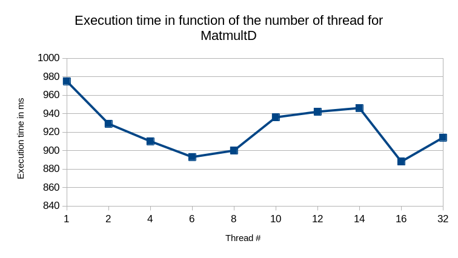
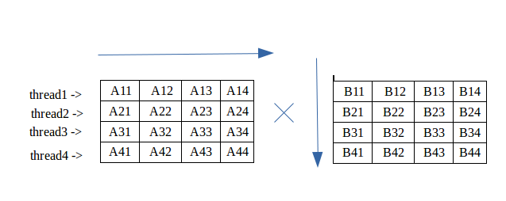
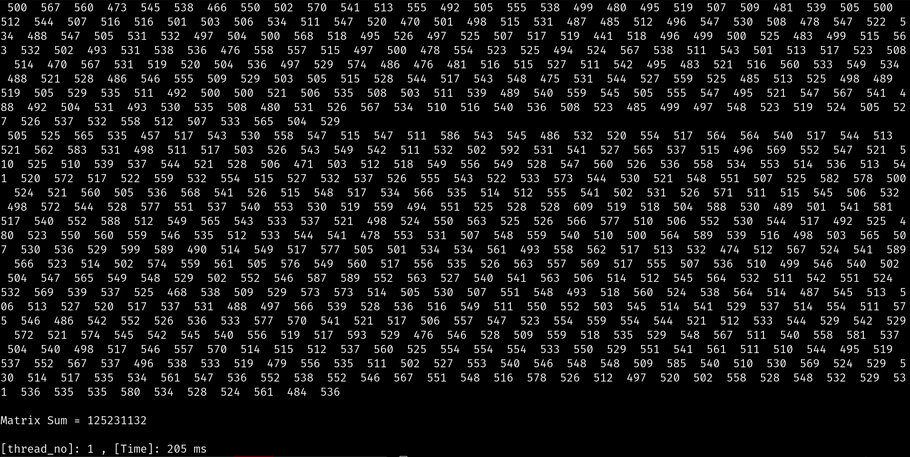
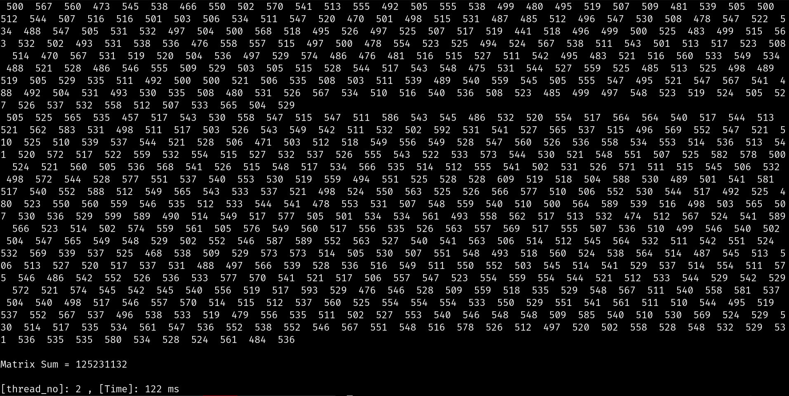
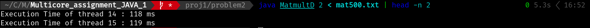
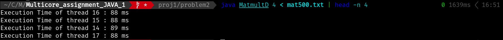

# Problem2 report

**Antoine DESRUET 50221600**

## Environnement

| Os     | Pop!_OS 22.04 LTS x86         |
|--------|-------------------------------|
| CPU    | Intel i7-8665U (8) @ 1.900GHz |
| Memory | 16Gb                          |
|Java version | openjdk 17.0.6 2023-01-17|

## Build

In the `problem2` directory

```sh
javac MatmultD.java
```

## How to use

```sh
java MatmultD NUM_THREAD < mat500.txt 
```

If you want to see the execution time of each thread:

```sh
java MatmultD NUM_THREAD < mat500.txt | head -n NUM_THREAD
```

## Results

### Raw

| Number of threads | Execution time in ms |
|-------------------|----------------------|
| 1                 | 975.000              |
| 2                 | 929.000              |
| 4                 | 910.000              |
| 6                 | 893.000              |
| 8                 | 900.000              |
| 10                | 936.000              |
| 12                | 942.000              |
| 14                | 946.000              |
| 16                | 888.000              |
| 32                | 914.000              |

### Graph



## Interpretation

For this exercise, static load balencing seems to be the best way to calculate the product of 2 matrix. As the size of each matrix is known, we can divide the process in multiple threads.

Based on the following picture from [geeks for geeks](https://www.geeksforgeeks.org/multiplication-of-matrix-using-threads/)



I decided to use the `2D CYCLIC,*` task repartition, where one line of the matrix A is one task.

> We can also use the `2D BLOCK,*` task repartition

If we look at the results we can see that the speed increase between 6 and 16 threads. So we can say that 6 threads are enought for a `500 * 500` matrix multiplied by another `500 * 500` matrix.

## Source code

### MatmultD.java

```java
import java.util.*;
import java.lang.*;

class MatMulThread extends Thread {
  int _matrixA[][];
  int _matrixB[][];
  int _matrixResult[][];
  int _startLine;
  int _nThread;

  MatMulThread(int a[][], int b[][], int c[][], int startLine, int nThread) {
    _matrixA = a;
    _matrixB = b;
    _matrixResult = c;
    _startLine = startLine;
    _nThread = nThread;
  }

  public void run() {
    long startTime = System.currentTimeMillis();
    multMatrix();
    long endTime = System.currentTimeMillis();
    long timeDiff = endTime - startTime;
    System.out.printf("Execution Time of thread %d : %d ms\n", Thread.currentThread().getId(), timeDiff);
  }

  private void multMatrix() {
    if (_matrixA.length == 0)
      return;
    if (_matrixA[0].length != _matrixB.length)
      return;

    int A_MatrixLineSize = _matrixA[0].length;
    int A_MatrixColSize = _matrixA.length;
    int B_MatrixColSize = _matrixB.length; 

    for (int i = _startLine; i < A_MatrixColSize; i += _nThread) {
      for (int j = 0; j < B_MatrixColSize; j++) {
        for (int k = 0; k < A_MatrixLineSize; k++) {
          // no lock because we can assume that only one thread will access this memory
          // location
          _matrixResult[i][j] += _matrixA[i][k] * _matrixB[k][j];
        }
      }
    }
  }

}

public class MatmultD {
  private static Scanner sc = new Scanner(System.in);

  public static void main(String[] args) {
    int thread_no = args.length == 1 ? Integer.valueOf(args[0]) : 1;

    int a[][] = readMatrix();
    int b[][] = readMatrix();
    int m = a.length;
    int p = b[0].length;
    int c[][] = new int[m][p];
    MatMulThread threads[] = new MatMulThread[thread_no];

    long startTime = System.currentTimeMillis();

    for (int i = 0; i < threads.length; ++i) {
      threads[i] = new MatMulThread(a, b, c, i, thread_no);
      threads[i].start();
    }
    for (int i = 0; i < threads.length; ++i) {
      try {
        threads[i].join();
      } catch (InterruptedException e) {
      }
    }
    long endTime = System.currentTimeMillis();
    printMatrix(c);
    System.out.printf("[thread_no]:%2d , [Time]:%4d ms\n", thread_no, endTime - startTime);
  }

  public static int[][] readMatrix() {
    int rows = sc.nextInt();
    int cols = sc.nextInt();
    int[][] result = new int[rows][cols];
    for (int i = 0; i < rows; i++) {
      for (int j = 0; j < cols; j++) {
        result[i][j] = sc.nextInt();
      }
    }
    return result;
  }

  public static void printMatrix(int[][] mat) {
    System.out.println("Matrix[" + mat.length + "][" + mat[0].length + "]");
    int rows = mat.length;
    int columns = mat[0].length;
    int sum = 0;
    for (int i = 0; i < rows; i++) {
      for (int j = 0; j < columns; j++) {
        System.out.printf("%4d ", mat[i][j]);
        sum += mat[i][j];
      }
      System.out.println();
    }
    System.out.println();
    System.out.println("Matrix Sum = " + sum + "\n");
  }
}
```

## Execution screenshots

### 1 thread



### 2 threads




### 4 threads



