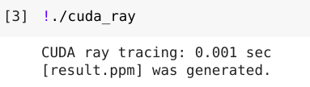

# Problem1

## Environment

| Os               | Pop!_OS 22.04 LTS x86         |
|------------------|-------------------------------|
| CPU              | Intel i7-8665U (8) @ 1.900GHz |
| Memory           | 16Gb                          |
| GCC version      | 14.0.0                        |
| GNU Make version | 4.3                           |
| GPU              | Google Colab                  |

## Build

### openmp_ray.cpp

```shell
make
```

or

```shell
g++ -o openmp_ray ./openmp_ray.cpp -fopenmp
```

### cuda_ray.cu

```shell
nvcc ./test_cuda.cu -o cuda_ray
```

## Outputs

### Open MP


### Cuda



